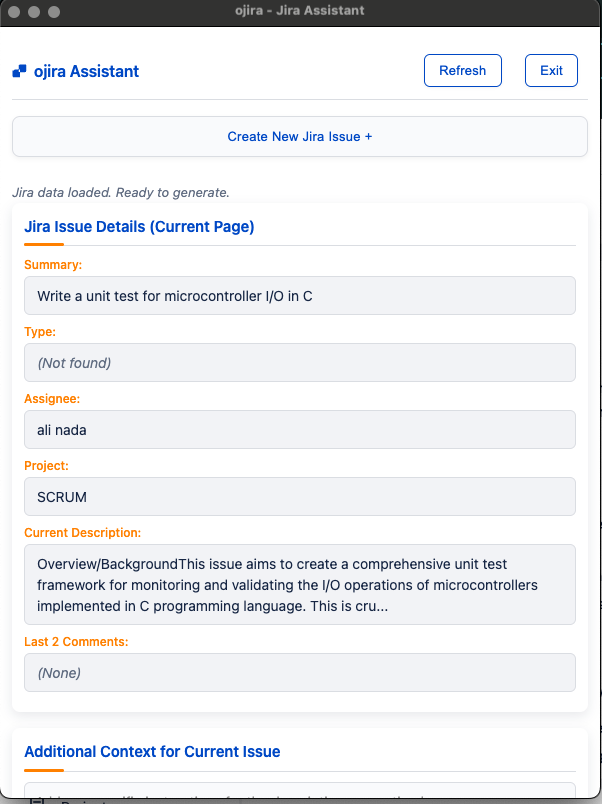
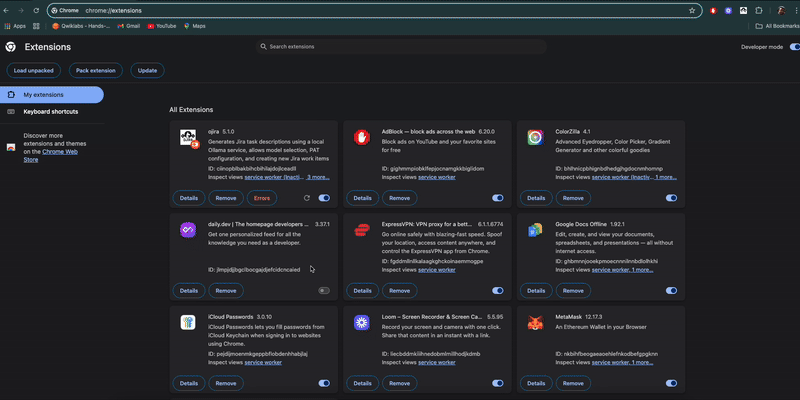

<p align="center">
  
</p>

# ojira - AI Powered Jira Description Generator

ojira helps you quickly generate well-structured Jira task descriptions using your local Ollama AI models. Save time and improve your Jira tickets with AI-generated content based on existing issue details.

## Demo Video

📺 [Watch the ojira Demo Video](https://www.youtube.com/watch?v=P4T8hPtvzCE&ab_channel=AN)

## Demo Screenshots

<p align="center">
  
  <br><em>Creating a new Jira issue with ojira</em>
</p>

<p align="center">
  
  <br><em>ojira reading and processing Jira ticket information</em>
</p>

## Key Features

✅ Uses your local Ollama AI models to generate Jira descriptions  
✅ Fetches context from active Jira pages  
✅ Allows customizable prompts  
✅ Seamlessly integrates with Jira  
✅ Keeps your data local and secure

## Quick Setup

1. **Requirements:**
   - Google Chrome browser
   - [Ollama](https://ollama.com/) installed and running
   - Jira account with access to create/edit issues
   - Jira Personal Access Token (PAT)

## Installation & Configuration

1. **Install the Extension:**
   - Unzip the `ojira_extension_vX.X.X.zip` file
   - Go to `chrome://extensions` and enable "Developer mode"
   - Click "Load unpacked" and select the extension folder
   - Verify the extension icon appears in Chrome toolbar

2. **Configure Jira PAT:**
   - Generate a PAT from your Jira profile with write permissions
   - Right-click the ojira icon in Chrome and select "Options"
   - Paste your PAT and save

   <p align="center">
     
     <br><em>Configuration of the ojira extension options</em>
   </p>

3. **Setup Ollama:**
   - Start Ollama with CORS enabled:
     ```bash
     OLLAMA_ORIGINS=* ollama serve
     ```
   - Pull a model if needed:
     ```bash
     ollama pull llama3
     ```
   - In extension Options, select your preferred model

4. **Select Model:**
   - In the extension Options, choose which Ollama model to use
   - Click "Save Model Selection"

## How to Use

1. **Open a Jira Issue** in your browser
2. **Click the ojira extension icon** in your toolbar
3. **Add Instructions** (optional) to guide the AI
4. **Click "Generate Description"** to create content
5. **Review & Edit** the generated description
6. **Click "Insert into Jira"** to update your ticket

The extension automatically fetches issue details including summary, type, assignee, project name, and existing description to provide context to the AI.

## Common Issues

- **403 Forbidden Error**: Start Ollama with `OLLAMA_ORIGINS=* ollama serve`
- **Can't Connect to API**: Make sure Ollama is running (`http://localhost:11434`)
- **No Models Available**: Run `ollama pull llama3` or your preferred model
- **PAT Not Working**: Ensure your Jira token has write permissions

## More Help

For a complete walkthrough, watch our [demo video](https://www.youtube.com/watch?v=P4T8hPtvzCE&ab_channel=AN)

