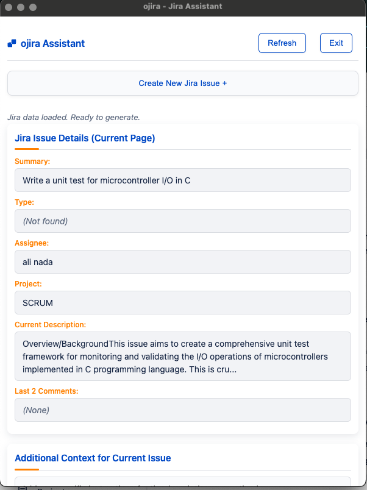
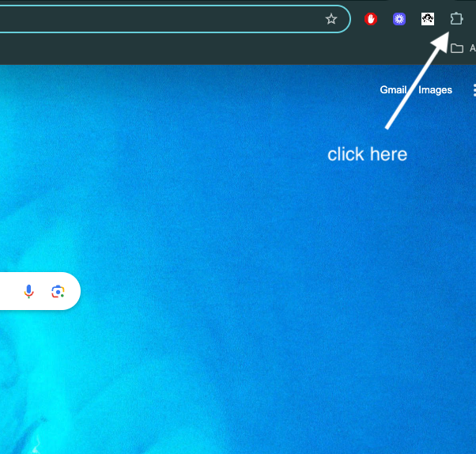
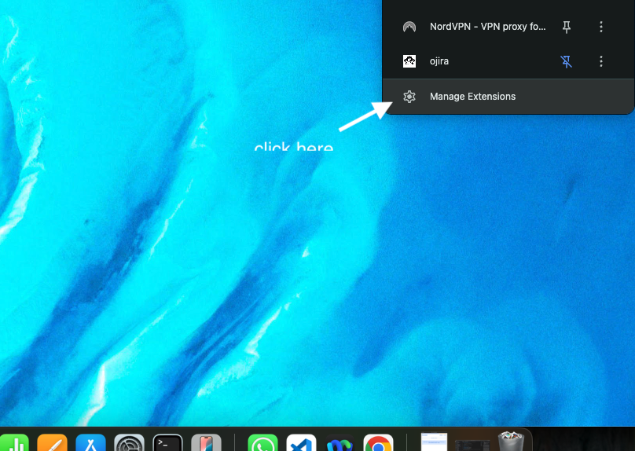
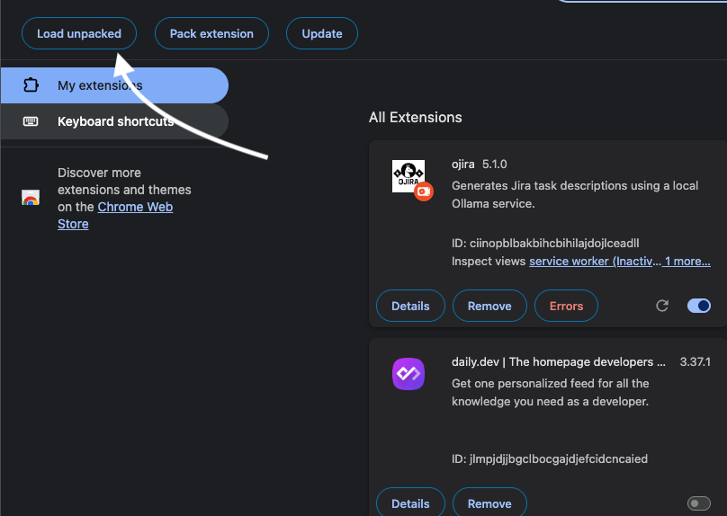
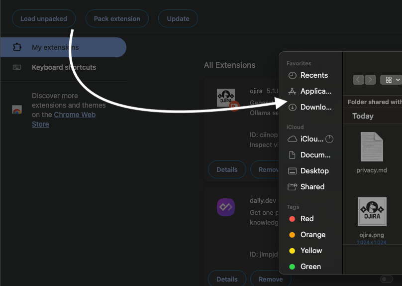
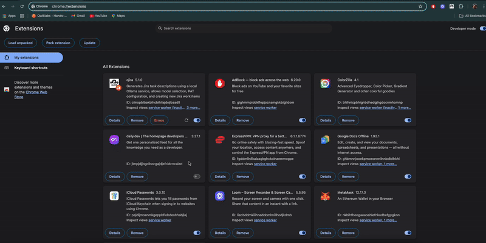

<p align="center">
  
</p>

# ojira - AI Powered Jira Description Generator

ojira helps you quickly generate well-structured Jira task descriptions using your local Ollama AI models. Save time and improve your Jira tickets with AI-generated content based on existing issue details.

<p align="center">
  <a href="https://chromewebstore.google.com/detail/ojira/ggamcmddhgfibjhjlcopdmnfopfahngm">
    
  </a>
</p>

## 🎉 Celebrating Version 5.1.0!

We're excited to announce version 5.1.0 of ojira with significant improvements:

- **Enhanced User Interface**: Completely refreshed UI for a more intuitive experience
- **Dynamic Issue Creation**: Generate issues and tasks dynamically based on the selected project
- **Project-Specific Issue Types**: Automatically load appropriate issue types for each project
- **Improved AI Generation**: Better context handling for more relevant descriptions

## 📺 Demo Video
[](https://www.youtube.com/watch?v=VIDEO_ID)


## Demo Screenshots

<p align="center">
  
  <br><em>Creating a new Jira issue with ojira</em>
</p>

<p align="center">
  
  <br><em>ojira reading and processing Jira ticket information</em>
</p>

## Key Features

✅ Uses your local Ollama AI models to generate Jira descriptions  
✅ Fetches context from active Jira pages  
✅ Allows customizable prompts  
✅ Seamlessly integrates with Jira  
✅ Keeps your data local and secure

## Quick Setup

<p align="center">
  <a href="https://chromewebstore.google.com/detail/ojira/ggamcmddhgfibjhjlcopdmnfopfahngm">
    
  </a>
</p>

1. **Requirements:**
   - 🌐 Google Chrome browser
   - 🤖 [Ollama](https://ollama.com/) installed and running
   - 🔄 Jira account with access to create/edit issues
   - 🔑 Jira Personal Access Token (PAT)

## Installation & Configuration

<p align="center">
  <a href="https://chromewebstore.google.com/detail/ojira/ggamcmddhgfibjhjlcopdmnfopfahngm">
    
  </a>
</p>

### Option 1: Install from Chrome Web Store (Recommended)

1. **Visit the [Chrome Web Store page](https://chromewebstore.google.com/detail/ojira/ggamcmddhgfibjhjlcopdmnfopfahngm)** and click "Add to Chrome"
2. **Confirm the installation** when prompted
3. **Pin the extension** to your toolbar for easy access

### Option 2: Manual Installation (Developer Mode)

1. **Install the Extension:**
   - Unzip the `ojira_extension_vX.X.X.zip` file
   - Go to `chrome://extensions` and enable "Developer mode"
   - Click "Load unpacked" and select the extension folder
   - Verify the extension icon appears in Chrome toolbar

   <p align="center">
     
     <br><em>Step 1: Enable Developer Mode in Chrome Extensions</em>
   </p>
   
   <p align="center">
     
     <br><em>Step 2: Click the Load Unpacked button</em>
   </p>
   
   <p align="center">
     
     <br><em>Step 3: Select the ojira extension folder</em>
   </p>
   
   <p align="center">
     
     <br><em>Step 4: Verify the extension is installed</em>
   </p>

2. **Configure Jira PAT:**
   - Generate a PAT from your Jira profile with write permissions
   - Right-click the ojira icon in Chrome and select "Options"
   - Paste your PAT and save

   <p align="center">
     
     <br><em>Configuration of the ojira extension options</em>
   </p>

3. **Setup Ollama:**
   - Start Ollama with CORS enabled:
     ```bash
     OLLAMA_ORIGINS=* ollama serve
     ```
   - Pull a model if needed:
     ```bash
     ollama pull llama3
     ```
   - In extension Options, select your preferred model

4. **Select Model:**
   - In the extension Options, choose which Ollama model to use
   - Click "Save Model Selection"

## How to Use

<div align="center">
  <table>
    <tr>
      <td align="center"><b>Step 1</b></td>
      <td align="center"><b>Step 2</b></td>
      <td align="center"><b>Step 3</b></td>
    </tr>
    <tr>
      <td align="center">🔍 Open a Jira Issue</td>
      <td align="center">🧠 Add AI Instructions</td>
      <td align="center">✅ Insert into Jira</td>
    </tr>
  </table>
</div>

1. 🌐 **Open a Jira Issue** in your browser
2. 🖱️ **Click the ojira extension icon** in your toolbar
3. 💬 **Add Instructions** (optional) to guide the AI
4. 🚀 **Click "Generate Description"** to create content
5. 📝 **Review & Edit** the generated description
6. 💾 **Click "Insert into Jira"** to update your ticket

The extension automatically fetches issue details including summary, type, assignee, project name, and existing description to provide context to the AI.

## Common Issues

| Issue | Solution |
|-------|----------|
| ⚠️ **403 Forbidden Error** | Start Ollama with `OLLAMA_ORIGINS=* ollama serve` |
| 🔌 **Can't Connect to API** | Make sure Ollama is running (`http://localhost:11434`) |
| 📦 **No Models Available** | Run `ollama pull llama3` or your preferred model |
| 🔑 **PAT Not Working** | Ensure your Jira token has write permissions |

## License

This project is licensed under the MIT License with attribution requirements - see the [LICENSE](LICENSE) file for details.

## More Help

For a complete walkthrough, watch our [demo video](https://www.youtube.com/watch?v=P4T8hPtvzCE&ab_channel=AN)

---

<div align="center">
  <a href="https://chromewebstore.google.com/detail/ojira/ggamcmddhgfibjhjlcopdmnfopfahngm">
    
  </a>
  <p>
    <strong>ojira</strong> - AI Powered Jira Description Generator<br>
    Available on the <a href="https://chromewebstore.google.com/detail/ojira/ggamcmddhgfibjhjlcopdmnfopfahngm">Chrome Web Store</a>
  </p>
</div>

